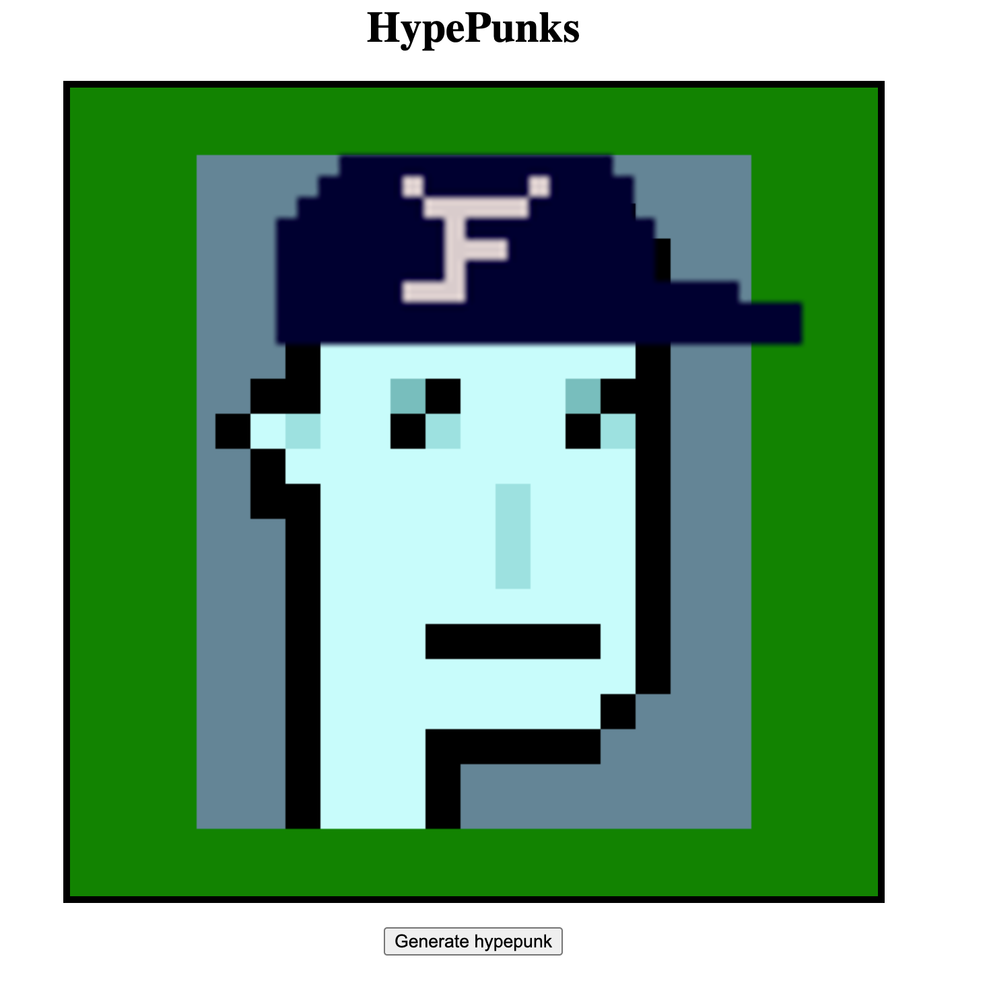
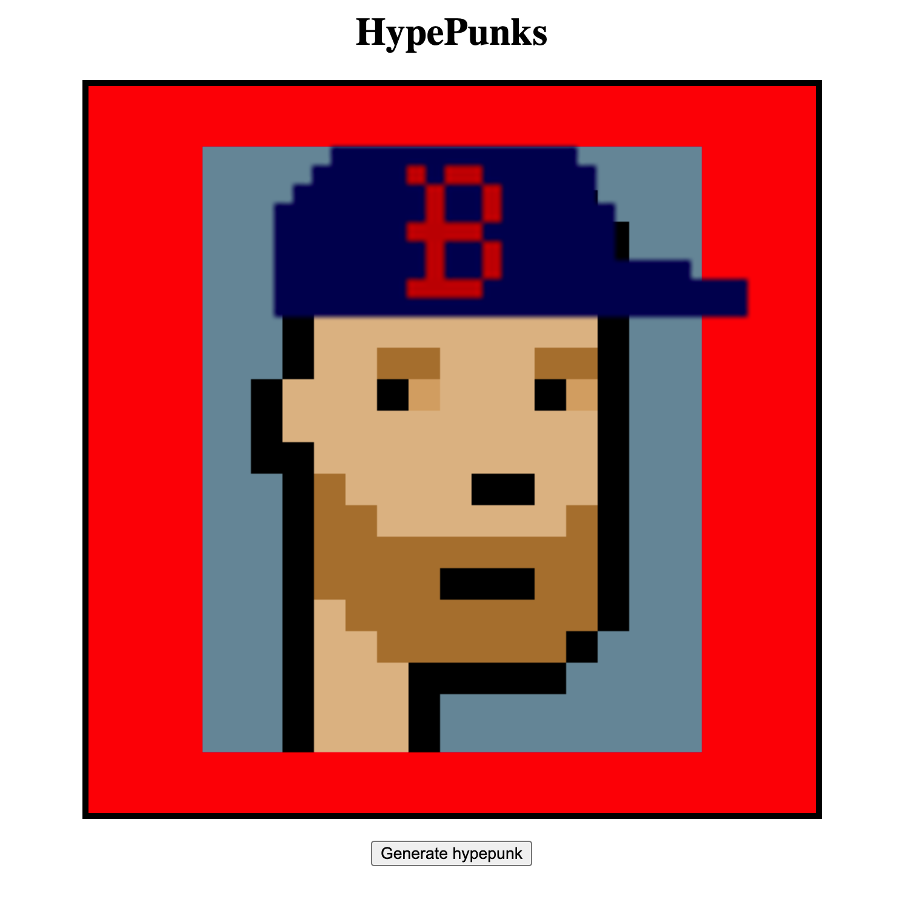

# hypepunks -- a generative art project

Generative art project that randomly create a "HypePunk". A hypepunk is a combination of  
a) a bald cryptopunk  
b) a fitted cap (Yankess, Red Sox, Astros, F.O.G)  
c) a background color (Blue, Red, Green, Gold)  

 
Everytime the Generate button is pressed it will create a random combination of a, b, and c
in order to create a one-of-a-kind hypepunk.

 
### Try It Here:
https://hypepunks.netlify.app/

### What They Look Like

